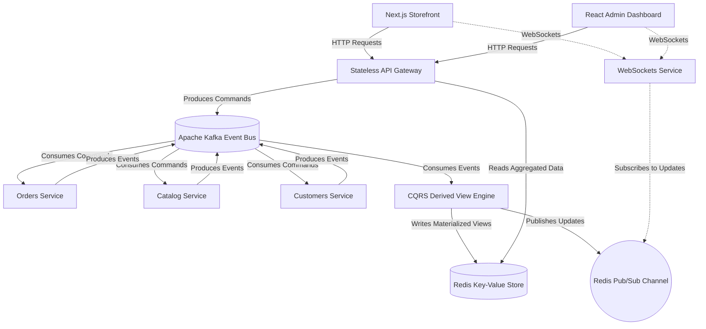

# Mini-AWS: Event-Driven Microservices E-Commerce Platform

This repository showcases a highly scalable, event-driven e-commerce platform that simulates AWS-grade microservices architecture. It demonstrates modern backend patterns, including **Event Sourcing**, **CQRS** (Command Query Responsibility Segregation), and **Real-Time WebSockets**, all built using Node.js and TypeScript.

## 🏗️ System Architecture

The entire system is decoupled. The API Gateway acts as a stateless entry point, passing commands into an Apache Kafka event stream. Specialized microservices handle the business logic and emit events back to Kafka. Finally, a CQRS engine aggregates these events into lightning-fast materialized views stored in Redis, which are synced to clients in real-time via WebSockets and Redis Pub/Sub.



## 🚀 Key Technical Highlights

* **Event-Driven Architecture:** Microservices communicate entirely asynchronously via Apache Kafka. Business logic is executed through decoupled commands and events (Sagas).
* **CQRS Pattern:** Write operations (Commands) are handled by individual microservices, while Read operations (Queries) are served from a single, pre-aggregated materialized view in Redis.
* **Real-Time Data Syncing:** A dedicated WebSocket microservice subscribes to a Redis Pub/Sub channel. Whenever the CQRS engine updates a materialized view, the update is instantly pushed to the Next.js and React frontends without HTTP polling.
* **Distributed Tracing:** Fully instrumented with OpenTelemetry and Jaeger. Every API request and asynchronous Kafka message is traced across the entire microservice ecosystem, providing deep observability into saga executions and latency.
* **High-Performance Local State:** Microservices utilize LMDB for ultra-fast, zero-copy local state processing before emitting final events.
* **Stateless API Gateway:** The API Gateway holds zero state and maintains no persistent socket connections, allowing it to be elastically scaled behind an Application Load Balancer (e.g., AWS ECS/Fargate).

## 🛠️ Tech Stack

* **Frontend:** Next.js (App Router, Server Components), React (Vite)
* **Backend:** Node.js, Express, TypeScript
* **Observability & Tracing:** OpenTelemetry, Jaeger
* **Messaging & Pub/Sub:** Apache Kafka, Redis Pub/Sub
* **Databases:** Redis (Materialized Views), PostgreSQL (Customer Data), LMDB (Ultra-fast Local State)
* **Real-Time:** Socket.io

## 📦 How to Run Locally

1. **Start Infrastructure Services** (Requires Docker):
   Ensure Kafka, Zookeeper, Redis, and PostgreSQL are running.
   ```bash
   docker-compose up -d
   ```

2. **Install Dependencies**:
   ```bash
   pnpm install
   ```

3. **Start the Microservices Cluster**:
   Using PM2 or a concurrent runner, boot the entire stack:
   ```bash
   pnpm dev
   ```

4. **Access the Applications**:
   * Storefront: `http://localhost:3001`
   * Management Dashboard: `http://localhost:5178`
   * API Gateway: `http://localhost:3000`
   * Jaeger: `http://localhost:16686` 
