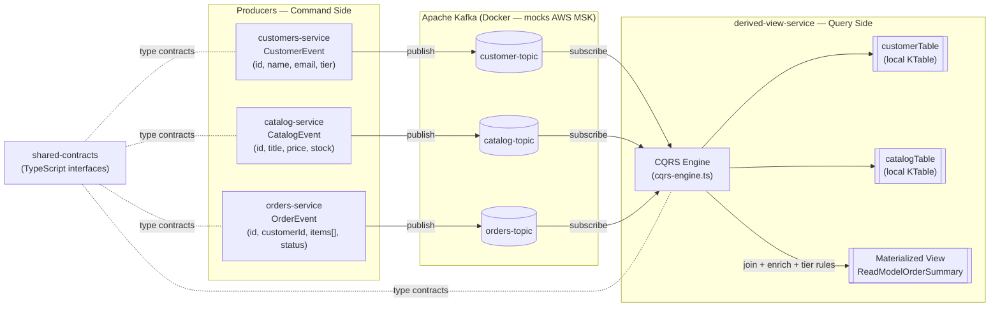
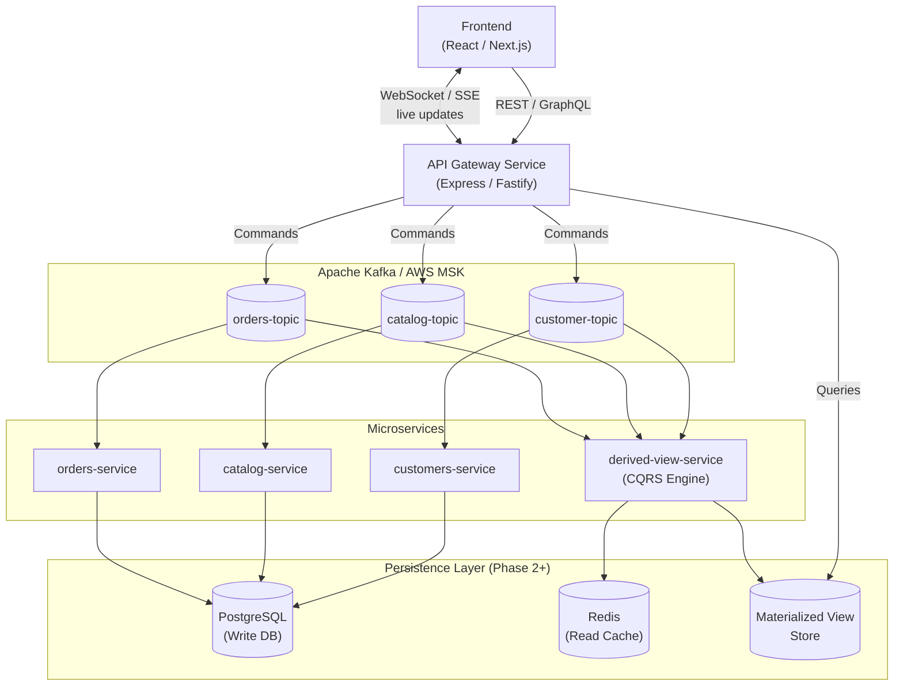

# mini-aws — Event-Driven Architecture Mockup

> A hands-on mockup project that replicates AWS-style distributed systems using **Apache Kafka**, **Node.js**, and **TypeScript** — entirely on your local machine.

---

## What Is This?

**mini-aws** is a learning/prototype project that simulates the core concepts behind production-grade AWS microservice architectures without requiring any cloud account or real infrastructure.

It mimics the following AWS primitives locally:

| Local Component | AWS Equivalent |
|---|---|
| Confluent Kafka (Docker) | Amazon MSK (Managed Streaming for Kafka) |
| `customers-service` | Cognito / DynamoDB Streams (user profile events) |
| `catalog-service` | DynamoDB Streams / EventBridge (product inventory events) |
| `orders-service` | SQS / EventBridge (order checkout commands) |
| `derived-view-service` | Lambda + DynamoDB (CQRS materialized view processor) |
| `shared-contracts` | AWS Schema Registry (shared event type contracts) |

---

## Current Architecture

The system is built around the **CQRS (Command Query Responsibility Segregation)** and **Event Sourcing** patterns. Three independent producer services stream domain events onto dedicated Kafka topics. A single consumer engine joins and materializes those streams into a queryable read model — with no REST calls between services.

```
┌────────────────────────────────────────────────────────────────────────────┐
│                          mini-aws  —  Current Flow                         │
│                                                                            │
│   PRODUCERS (Write / Command Side)          KAFKA BROKER (Docker)          │
│   ─────────────────────────────             ──────────────────────         │
│                                                                            │
│  ┌─────────────────────┐                  ┌──────────────────────┐         │
│  │  customers-service  │ ─── publish ───► │   customer-topic     │         │
│  │  (Node.js / TS)     │                  └──────────┬───────────┘         │
│  │  CustomerEvent      │                             │                     │
│  └─────────────────────┘                             │                     │
│                                                      │                     │
│  ┌─────────────────────┐                  ┌──────────▼───────────┐         │
│  │  catalog-service    │ ─── publish ───► │   catalog-topic      │         │
│  │  (Node.js / TS)     │                  └──────────┬───────────┘         │
│  │  CatalogEvent       │                             │                     │
│  └─────────────────────┘                             │                     │
│                                                      ▼                     │
│  ┌─────────────────────┐                  ┌──────────────────────┐         │
│  │  orders-service     │ ─── publish ───► │   orders-topic       │         │
│  │  (Node.js / TS)     │                  └──────────┬───────────┘         │
│  │  OrderEvent         │                             │                     │
│  └─────────────────────┘                             │                     │
│                                                      │                     │
│   ─────────────────────────────────────────          │                     │
│   CONSUMER (Read / Query Side)                       │                     │
│   ─────────────────────────────────────────          │                     │
│                                                      ▼                     │
│                                        ┌─────────────────────────┐         │
│                                        │   derived-view-service  │         │
│                                        │   CQRS Engine           │         │
│                                        │   ─────────────────     │         │
│                                        │   • customerTable  ◄────┤ sub     │
│                                        │   • catalogTable   ◄────┤ sub     │
│                                        │   • join + enrich  ◄────┘ sub     │
│                                        │   • apply tier rules    |         │
│                                        │   ─────────────────     │         │
│                                        │   ► Materialized View   │         │
│                                        │     (in-memory store)   │         │
│                                        └─────────────────────────┘         │
│                                                                            │
│   shared-contracts  ─── TypeScript interfaces shared across all services   │
└────────────────────────────────────────────────────────────────────────────┘
```

### Data Flow Diagram (Mermaid)



---

## Project Structure

```
mini-aws/
├── docker-compose.yaml          # Kafka broker + topic init (mocks AWS MSK)
│
├── shared-contracts/            # Shared TypeScript event interfaces
│   └── src/interfaces.ts        # CustomerEvent, CatalogEvent, OrderEvent
│
├── customers-service/           # Streams user profile & tier events
│   └── src/customers-producer.ts
│
├── catalog-service/             # Streams product & price change events
│   └── src/catalog-producer.ts
│
├── orders-service/              # Streams checkout / order command events
│   └── src/orders-producer.ts
│
└── derived-view-service/        # CQRS consumer: joins streams → read model
    └── src/cqrs-engine.ts
```

---

## Getting Started

### Prerequisites

- [Docker](https://www.docker.com/) + Docker Compose
- [Node.js](https://nodejs.org/) 18+
- [pnpm](https://pnpm.io/)

### 1. Start Kafka

```bash
docker-compose up -d
```

This starts a single-node Kafka broker (KRaft mode, no Zookeeper) and auto-creates the three topics.

### 2. Install Dependencies

Run in each service directory:

```bash
cd customers-service && pnpm install
cd ../catalog-service && pnpm install
cd ../orders-service && pnpm install
cd ../derived-view-service && pnpm install
```

### 3. Run Services

Open four terminals and run each service:

```bash
# Terminal 1
cd customers-service && pnpm dev

# Terminal 2
cd catalog-service && pnpm dev

# Terminal 3
cd orders-service && pnpm dev

# Terminal 4 — the live CQRS dashboard
cd derived-view-service && pnpm dev
```

The `derived-view-service` terminal will render a live dashboard showing enriched, joined order records as they stream in.

### 4. Stop

```bash
docker-compose down
```

---

## Key Concepts Demonstrated

| Concept | Where |
|---|---|
| **Event Sourcing** | Each service publishes immutable domain events to a topic |
| **CQRS** | Producers own the write side; `derived-view-service` owns the read side |
| **Stream-Table Join** | `cqrs-engine.ts` maintains local KTables and joins on order arrival |
| **Tier-based business rules** | PREMIUM customers receive a 10% discount applied at read time |
| **Schema Contracts** | `shared-contracts` enforces a single source of truth for event shapes |
| **No inter-service HTTP** | Services communicate exclusively through Kafka — zero coupling |

---

## Roadmap — Towards a Full Production System

This project will grow beyond a mockup. The planned phases are:

### Phase 2 — Persistence & Real CRUD
- Replace in-memory KTables with a real database (PostgreSQL / Redis)
- Persist the materialized view to a queryable store
- Add proper event replay / offset management
- Introduce **dead-letter topics** for failed message handling

### Phase 3 — REST / GraphQL API Layer
- Build an **API Gateway service** (Express / Fastify / NestJS) that:
  - Exposes REST or GraphQL endpoints consumed by a frontend
  - Reads from the materialized view (query side)
  - Accepts commands (POST /orders, POST /customers) and publishes them to Kafka (write side)
- Add authentication (JWT / OAuth2)

### Phase 4 — Frontend Integration
- React / Next.js frontend connecting to the API Gateway
- Real-time updates via WebSockets or SSE fed by Kafka consumer events
- Live order dashboard, catalog browser, customer profile management

### Phase 5 — Cloud-Ready
- Replace Docker Kafka with **AWS MSK**
- Deploy services as **AWS ECS / Lambda** functions
- Use **AWS API Gateway** in front of the REST layer
- Add **CloudWatch** observability and alerting



---

## Tech Stack

| Layer | Technology |
|---|---|
| Language | TypeScript (Node.js) |
| Messaging | Apache Kafka (KafkaJS client) |
| Infrastructure | Docker Compose (Confluent Kafka image) |
| Package Manager | pnpm |
| Future API | Express / Fastify / NestJS |
| Future Frontend | React / Next.js |
| Future Cloud | AWS MSK, ECS, API Gateway |

---

## License

MIT
