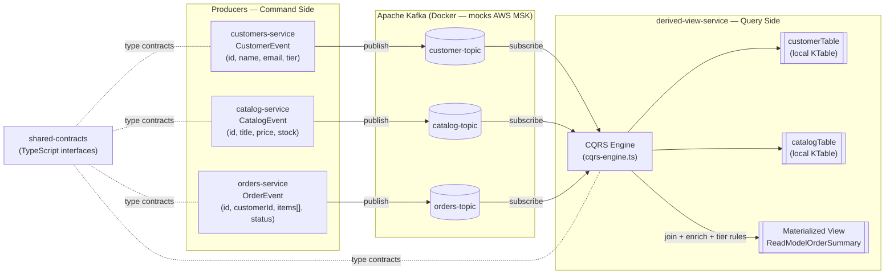
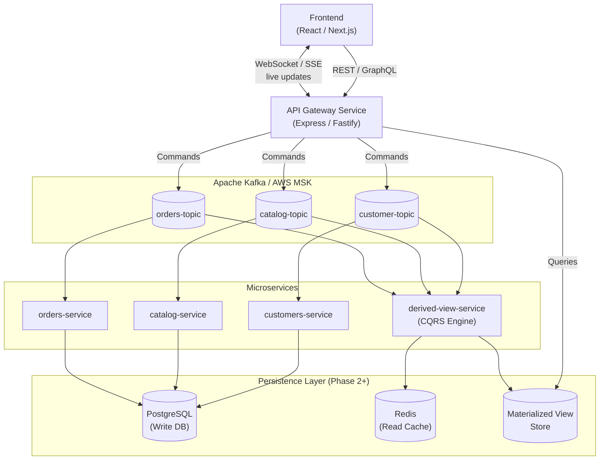

# mini-aws — Event-Driven Architecture Mockup

> A hands-on mockup project that replicates AWS-style distributed systems using **Apache Kafka**, **Node.js**, and **TypeScript** — entirely on your local machine.

---

## What Is This?

**mini-aws** is a learning/prototype project that simulates the core concepts behind production-grade AWS microservice architectures without requiring any cloud account or real infrastructure.

It mimics the following AWS primitives locally:

| Local Component | AWS Equivalent |
|---|---|
| Confluent Kafka (Docker) | Amazon MSK (Managed Streaming for Kafka) |
| `customers-service` | Cognito / DynamoDB Streams (user profile events) |
| `catalog-service` | DynamoDB Streams / EventBridge (product inventory events) |
| `orders-service` | SQS / EventBridge (order checkout commands) |
| `derived-view-service` | Lambda + Redis (CQRS materialized view processor) |
| `shared-contracts` | AWS Schema Registry (shared event type contracts) |
| `otel-collector` | AWS X-Ray (Distributed Tracing & Metrics) |

---

## Current Architecture

The system is built around the **Distributed Saga**, **CQRS (Command Query Responsibility Segregation)**, and **Event Sourcing** patterns. Three independent worker services process commands and stream domain events onto dedicated Kafka topics. A CQRS engine consumes these streams into a queryable read model (Redis) which is exposed via an **API Gateway**.

### The Observability Stack (New!)
The entire system is fully instrumented with **OpenTelemetry**. Traces, Spans, and Service Performance Metrics (SPM) flow through an OTel Collector into **Prometheus** and are visualized beautifully in **Jaeger v2**. Every HTTP request, Postgres query, and Kafka message (via custom manual context propagation) is tracked.

```
┌────────────────────────────────────────────────────────────────────────────┐
│                          mini-aws  —  Current Flow                         │
│                                                                            │
│   PRODUCERS (Write / Command Side)          KAFKA BROKER (Docker)          │
│   ─────────────────────────────             ──────────────────────         │
│                                                                            │
│  ┌─────────────────────┐                  ┌──────────────────────┐         │
│  │  customers-service  │ ─── publish ───► │   customer-topic     │         │
│  │  (Node.js / TS)     │                  └──────────┬───────────┘         │
│  │  CustomerEvent      │                             │                     │
│  └─────────────────────┘                             │                     │
│                                                      │                     │
│  ┌─────────────────────┐                  ┌──────────▼───────────┐         │
│  │  catalog-service    │ ─── publish ───► │   catalog-topic      │         │
│  │  (Node.js / TS)     │                  └──────────┬───────────┘         │
│  │  CatalogEvent       │                             │                     │
│  └─────────────────────┘                             │                     │
│                                                      ▼                     │
│  ┌─────────────────────┐                  ┌──────────────────────┐         │
│  │  orders-service     │ ─── publish ───► │   orders-topic       │         │
│  │  (Node.js / TS)     │                  └──────────┬───────────┘         │
│  │  OrderEvent         │                             │                     │
│  └─────────────────────┘                             │                     │
│                                                      │                     │
│   ─────────────────────────────────────────          │                     │
│   CONSUMER (Read / Query Side)                       │                     │
│   ─────────────────────────────────────────          │                     │
│                                                      ▼                     │
│                                        ┌─────────────────────────┐         │
│                                        │   derived-view-service  │         │
│                                        │   CQRS Engine           │         │
│                                        │   ─────────────────     │         │
│                                        │   • customerTable  ◄────┤ sub     │
│                                        │   • catalogTable   ◄────┤ sub     │
│                                        │   • join + enrich  ◄────┘ sub     │
│                                        │   • apply tier rules    |         │
│                                        │   ─────────────────     │         │
│                                        │   ► Materialized View   │         │
│                                        │     (in-memory store)   │         │
│                                        └─────────────────────────┘         │
│                                                                            │
│   shared-contracts  ─── TypeScript interfaces shared across all services   │
└────────────────────────────────────────────────────────────────────────────┘
```

### Data Flow Diagram (Mermaid)



---

## Project Structure

```
mini-aws/                        ← monorepo root
├── package.json                 # root scripts (dev, build, typecheck)
├── pnpm-workspace.yaml          # declares all workspace packages
├── tsconfig.base.json           # shared TS compiler settings (extended by each service)
├── docker-compose.yaml          # Kafka broker + topic init (mocks AWS MSK)
│
├── shared-contracts/            # workspace package — single source of truth for event types
│   └── src/
│       ├── interfaces.ts        # CustomerEvent, CatalogEvent, OrderEvent
│       └── index.ts             # re-export entry point
│
├── customers-service/           # workspace package — streams user profile & tier events
│   └── src/customers-producer.ts
│
├── catalog-service/             # workspace package — streams product & price change events
│   └── src/catalog-producer.ts
│
├── orders-service/              # workspace package — streams checkout / order command events
│   └── src/orders-producer.ts
│
└── derived-view-service/        # workspace package — CQRS consumer: joins streams → read model
    └── src/cqrs-engine.ts
```

---

## Monorepo

This repo is a **pnpm workspace** monorepo. All packages are managed from the root — there is no need to `cd` into individual service folders.

### Workspace structure

| File | Purpose |
|---|---|
| `pnpm-workspace.yaml` | Tells pnpm which folders are packages and links them together |
| `tsconfig.base.json` | Shared TypeScript settings; each service extends this with `"extends": "../tsconfig.base.json"` |
| `package.json` | Root-level scripts that orchestrate the whole repo |

### Root scripts

| Command | What it does |
|---|---|
| `pnpm dev` | Runs **all 4 services in parallel**, color-coded in one terminal (`concurrently`) |
| `pnpm dev:customers` | Runs only `customers-service` |
| `pnpm dev:catalog` | Runs only `catalog-service` |
| `pnpm dev:orders` | Runs only `orders-service` |
| `pnpm dev:view` | Runs only `derived-view-service` (the live CQRS dashboard) |
| `pnpm build` | Builds all packages with `tsup` (ESM output to each `dist/`) |
| `pnpm typecheck` | Runs `tsc --noEmit` across every package |

### How `shared-contracts` is linked

Each service declares `"shared-contracts": "workspace:*"` in its `dependencies`. pnpm symlinks the local package into each service's `node_modules` — no publishing to npm, no build step required in development. Imports resolve directly to the TypeScript source:

```ts
import { CustomerEvent } from 'shared-contracts';
```

### Adding a new package

1. Create the folder at the repo root
2. Add a `package.json` with a unique `name`
3. Add it to `pnpm-workspace.yaml`
4. Run `pnpm install` from the root — pnpm links everything automatically

---

## Getting Started

### Prerequisites

- [Docker](https://www.docker.com/) + Docker Compose
- [Node.js](https://nodejs.org/) 18+
- [pnpm](https://pnpm.io/)

### 1. Install all dependencies

Run once from the **repo root** — installs and links all workspace packages in one shot:

```bash
pnpm install
```

> First install will prompt: `pnpm approve-builds` — select `esbuild` and confirm. This downloads esbuild's native binary needed by `tsup`.

### 2. Start Kafka

```bash
docker-compose up -d
```

Starts a single-node Kafka broker (KRaft mode, no Zookeeper) and auto-creates the three topics.

### 3. Run all services

```bash
pnpm dev
```

This starts all four services in parallel in one terminal, each with a colored label:

```
[customers] 👥 Customers Service Worker Online...
[catalog]   📦 Catalog Service Worker Online...
[orders]    🛒 Orders Service Worker Online...
[view]      📊 CQRS Derived View Engine Online...
[api-gateway] 🌐 API Gateway running on http://localhost:3000
```

### 4. View Distributed Traces

Open your browser to:
- **Jaeger UI:** `http://localhost:16686`
Search for `api-gateway` to see the full Distributed Saga waterfalls and auto-generated System Architecture graphs!

Or run a single service in isolation:

```bash
pnpm dev:view
```

### 4. Stop

```bash
# Stop all services
Ctrl+C

# Stop Kafka
docker-compose down
```

---

## Key Concepts Demonstrated

| Concept | Where |
|---|---|
| **Event Sourcing** | Each service publishes immutable domain events to a topic |
| **CQRS** | Producers own the write side; `derived-view-service` owns the read side |
| **Stream-Table Join** | `cqrs-engine.ts` maintains local KTables and joins on order arrival |
| **Tier-based business rules** | PREMIUM customers receive a 10% discount applied at read time |
| **Schema Contracts** | `shared-contracts` enforces a single source of truth for event shapes |
| **No inter-service HTTP** | Services communicate exclusively through Kafka — zero coupling |

---

## Roadmap — Towards a Full Production System

This project will continue to grow. The planned phases are:

### Phase 4 — Frontend Integration
- React / Next.js frontend connecting to the API Gateway
- Real-time updates via WebSockets or SSE fed by Kafka consumer events
- Live order dashboard, catalog browser, customer profile management

### Phase 5 — Cloud-Ready
- Replace Docker Kafka with **AWS MSK**
- Deploy services as **AWS ECS / Lambda** functions
- Use **AWS API Gateway** in front of the REST layer
- Add **CloudWatch** observability and alerting



---

## Tech Stack

| Layer | Technology |
|---|---|
| Language | TypeScript (Node.js) |
| API Gateway | Express |
| Messaging | Apache Kafka (KafkaJS client) |
| Database | PostgreSQL (Kysely), Redis (ioredis), & LMDB (Idempotency Cache) |
| Tracing & Metrics | OpenTelemetry, Prometheus, Jaeger v2 |
| Infrastructure | Docker Compose |
| Monorepo | pnpm workspaces |
| Dev runner | tsx (esbuild-based, no compile step) |
| Production build | tsup (esbuild bundler) |
| Multi-service dev | concurrently |
| Future Frontend | React / Next.js |
| Future Cloud | AWS MSK, ECS, API Gateway |

---

## License

MIT
