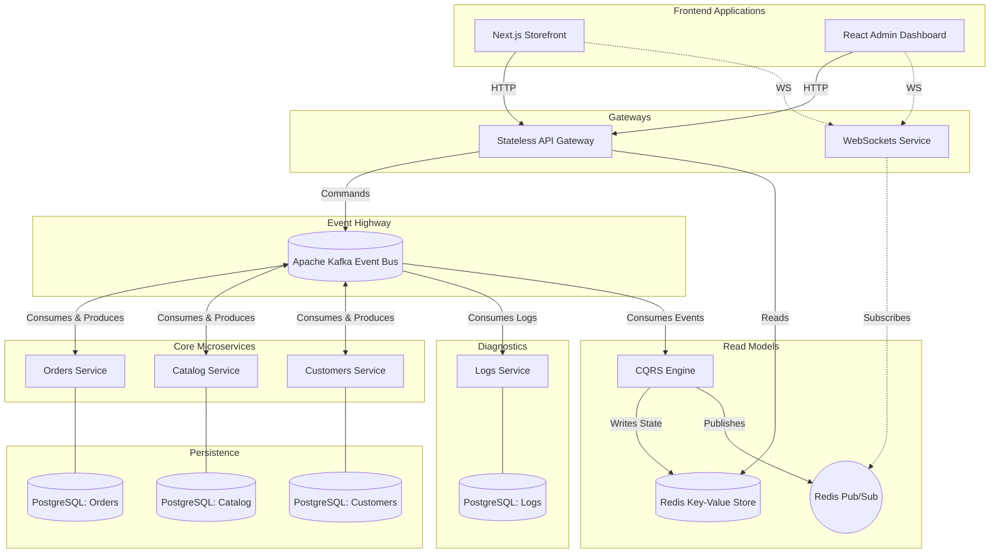

# Mini-AWS: Event-Driven Microservices E-Commerce Platform

This repository showcases a highly scalable, event-driven e-commerce platform that simulates AWS-grade microservices architecture. It demonstrates modern backend patterns, including **Event Sourcing**, **CQRS** (Command Query Responsibility Segregation), and **Real-Time WebSockets**, all built using Node.js and TypeScript.

## 💡 What Problem Does This Project Solve?

When an application grows, a **monolith** (one server that does everything) becomes a liability: every deploy risks breaking unrelated features, a single failure can take down the entire system, and you can only scale everything even when only one part is under load. This project simulates the solution companies like Amazon and Netflix adopted:

- **Deployment independence** — each service deploys on its own without affecting others
- **Failure isolation** — a crash in one service does not bring down the rest of the system
- **Scale where needed** — scale only the bottleneck, not the entire application
- **Data consistency without distributed locks** — Sagas + Transactional Outbox guarantee consistency across separate databases without a two-phase commit
- **Query performance at scale** — CQRS pre-computes answers into Redis so reads are O(1) lookups with no expensive JOINs

> **In one sentence:** This architecture solves the scalability, reliability, and team autonomy problems that emerge when a business grows beyond what a single server can handle.

## 🏗️ System Architecture

The entire system is decoupled. The API Gateway acts as a stateless entry point, passing commands into an Apache Kafka event stream. Specialized microservices handle the business logic and emit events back to Kafka. Finally, a CQRS engine aggregates these events into lightning-fast materialized views stored in Redis, which are synced to clients in real-time via WebSockets and Redis Pub/Sub.



## 🚀 Key Technical Highlights

* **Event-Driven Architecture:** Microservices communicate entirely asynchronously via Apache Kafka. Business logic is executed through decoupled commands and events.
* **Choreography-based Sagas:** Distributed transactions span multiple microservices without a central orchestrator. Complex workflows (like stock reservation & customer validation) run in parallel, and failures gracefully trigger **Compensating Transactions** to ensure eventual consistency.
* **Transactional Outbox Pattern:** Guarantees 100% reliable messaging. Kafka events are atomically saved to an outbox table within the same PostgreSQL transaction as the state updates, preventing dual-write split-brain issues. A background relay ensures messages are safely published even if a pod crashes mid-request.
* **Idempotent Consumers:** Cross-service message consumers utilize atomic Redis `SET NX` operations to enforce idempotency. Duplicate Kafka deliveries due to network retries or process crashes are safely ignored, strictly preventing catastrophic errors like double-charging or duplicate stock deductions.
* **CQRS Pattern:** Write operations (Commands) are handled by individual microservices, while Read operations (Queries) are served from a single, pre-aggregated materialized view in Redis.
* **Real-Time Data Syncing:** A dedicated WebSocket microservice subscribes to a Redis Pub/Sub channel. Whenever the CQRS engine updates a materialized view, the update is instantly pushed to the Next.js and React frontends without HTTP polling.
* **High-Performance Full-Text Search:** Powered by RediSearch and Redis JSON. The API Gateway utilizes inverted indexes and prefix matching (`FT.SEARCH`) to provide blazing-fast, sortable catalog search capabilities directly from the read models.
* **API Rate Limiting:** An atomic Token Bucket rate limiting algorithm is executed directly in the stateless API Gateway via a custom Redis Lua Script. This protects public endpoints from burst traffic while gracefully handling capacity and token refill rates. Authenticated admin roles dynamically bypass these restrictions.
* **Distributed Tracing:** Fully instrumented with OpenTelemetry and Jaeger. Every API request and asynchronous Kafka message is traced across the entire microservice ecosystem, providing deep observability into saga executions and latency.
* **Dead Letter Queue (DLQ):** Kafka consumers are hardened against poison-pill payloads. If a message encounters processing errors consecutively, it is automatically routed to a specialized DLQ topic (`<topic>-dlq`) to prevent the worker from crashing or stalling, allowing manual inspection and replay later.
* **Centralized System Logging:** A dedicated `logs-service` acts as a centralized sink for all diagnostic logging. Microservices use a `KafkaLogger` to emit fire-and-forget logs into a shared Kafka topic (`system-logs-topic`), which are then aggregated into a central PostgreSQL database. A background worker ensures the database is automatically pruned using a rolling FIFO retention policy (5,000 logs max) to prevent storage bloat.
* **High-Performance Distributed State:** Microservices utilize Redis hash sets for ultra-fast, distributed local state processing and data joins before emitting final events.
* **Stateless API Gateway:** The API Gateway holds zero state and maintains no persistent socket connections, allowing it to be elastically scaled behind an Application Load Balancer (e.g., AWS ECS/Fargate).

### Transactional Outbox vs Centralized Logging
While both patterns utilize Kafka, they serve fundamentally different purposes and happily co-exist within the architecture:
- **Transactional Outbox (Write-Ahead Log):** Ensures **Eventual Consistency** and **Reliable Messaging**. Critical business events (like `ORDER_CREATED`) are atomically saved to the database alongside state changes. A background relayer polls this table and guarantees these events reach Kafka, preventing split-brain issues even if a pod crashes mid-request.
- **Centralized Logging (CloudWatch Mockup):** Dedicated entirely to **Observability** and **Diagnostics**. Diagnostic messages (e.g., "Saga started") are shipped asynchronously to a central aggregation database in a fire-and-forget manner. This provides a searchable audit trail of system health without blocking or adding latency to the main business logic.

## 🛠️ Tech Stack

* **Frontend:** Next.js (App Router, Server Components), React (Vite)
* **Backend:** Node.js, Express, TypeScript
* **Observability & Tracing:** OpenTelemetry, Jaeger
* **Messaging & Pub/Sub:** Apache Kafka, Redis Pub/Sub
* **Databases:** Redis (Materialized Views, Fast Distributed State), PostgreSQL (Persistent Transactional Data)
* **Real-Time:** Socket.io

## 📦 How to Run Locally

1. **Start Infrastructure Services** (Requires Docker):
   Ensure Kafka, Zookeeper, Redis, and PostgreSQL are running.
   ```bash
   docker-compose up -d
   ```

2. **Install Dependencies**:
   ```bash
   pnpm install
   ```

3. **Configure Environment Variables**:
   Copy the example environment file and ensure the defaults match your setup.
   ```bash
   cp backend/.env.example backend/.env
   ```

4. **Start the Microservices Cluster**:
   Using PM2 or a concurrent runner, boot the entire stack:
   ```bash
   pnpm dev:all
   ```

5. **Access the Applications**:
   * Storefront: `http://localhost:3001`
   * Management Dashboard: `http://localhost:5178`
   * API Gateway: `http://localhost:3000`
   * Jaeger: `http://localhost:16686`
